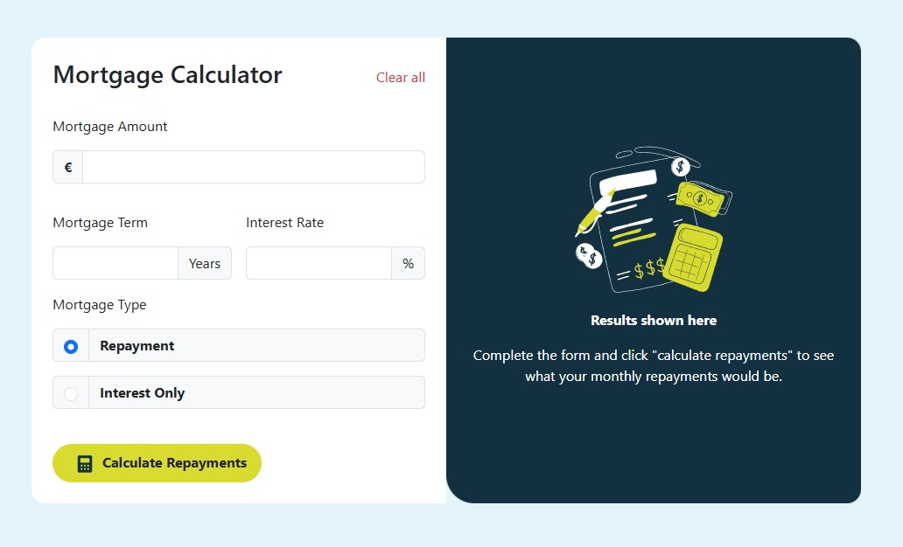

# Frontend Mentor - Mortgage repayment calculator solution

This is a solution to the [Mortgage repayment calculator challenge on Frontend Mentor](https://www.frontendmentor.io/challenges/mortgage-repayment-calculator-Galx1LXK73). Frontend Mentor challenges help you improve your coding skills by building realistic projects. 

## Table of contents

- [Overview](#overview)
  - [The challenge](#the-challenge)
  - [Screenshot](#screenshot)
  - [Links](#links)
- [My process](#my-process)
  - [Built with](#built-with)
  - [What I learned](#what-i-learned)
  - [Continued development](#continued-development)
  - [Useful resources](#useful-resources)
- [Author](#author)
- [Acknowledgments](#acknowledgments)

## Overview

### The challenge

Users should be able to:

- Input mortgage information and see monthly repayment and total repayment amounts after submitting the form
- See form validation messages if any field is incomplete
- Complete the form only using their keyboard
- View the optimal layout for the interface depending on their device's screen size
- See hover and focus states for all interactive elements on the page

-----------------------------------------------

Los usuarios podrán:

- Introducir la información de la hipoteca y ver los impores de las cuotas mensuales y totales después de enviar el formulario
- Ver los mensjaes de validación del formulario si algún campo está incompleto
- Completar el forulario usando el teclado
- Ver el diseño çoptimo de la interfaz según el tamaño de la pantalla de su dispositivo
- Ver los elementos interactivos activos de la página.

### Screenshot

### Links

- Solution URL: (https://github.com/aluqueg/Calculadora-Hipoteca)
- Live Site URL: (https://calculadora-hipoteca.netlify.app/)

## My process

### Built with

- Semantic HTML5 markup
- CSS custom properties
- Bootstrap
- React-Bootstrap
- Mobile-first workflow
- [React](https://reactjs.org/) - JS library

### What I learned

I have learned to pay attention to creating the structure of the project, first thinking about making it responsive.

----------------------

He aprendido a prestar atención a realizar la estructura del proyecto pensando primero en que sea responsive

### Continued development

For the following project I want to use an API

------------------------

Para el siguiente proyecto me gustaría consumir una API y mostrar los datos

### Useful resources

Using AI to support programming, not to find solutions

---------------------------

El uso de la IA para buscar apoyo, no soluciones

## Author

- Website - [Alvaro Luque Garcia](www.linkedin.com/in/aluqueg)
- Frontend Mentor - [@aluqueg](https://www.frontendmentor.io/profile/aluqueg)
- Github - [@aluqueg](https://github.com/aluqueg)
